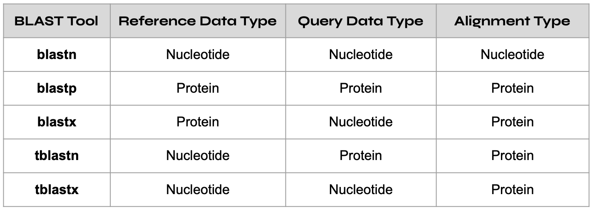
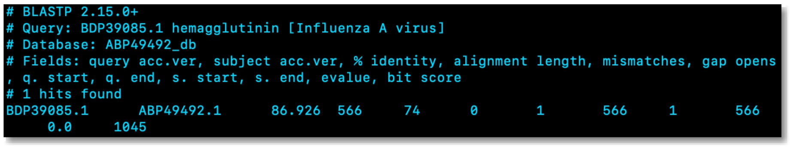

# 🧬 BLAST - The Biological Search Engine

BLAST (basic local alignment search tool) is a widely used bioinformatics tool for comparing biological sequences and findings regions of local similarity or homology. At its core, BLAST works by comparing a query (i.e., input) DNA, RNA, and protein sequence against a database of known sequences. The output of a BLAST search is typically a list of sequence alignments, each scored and ranked based on the degree of similarity and their statistical significance, providing researchers with valuable information about potential evolutionary relationships or functional similarities.

Think of BLAST as the Google for DNA, RNA, and protein sequences—a search engine designed to pinpoint reference sequences closely matching your query. Just as there are various search engines, BLAST comes in multiple versions, each offering slightly different results. It's akin to comparing a Google and Bing search — the same query may yield different outcomes.

Additionally, like any search engine, there are functional constraints to how long or short a query can be for you to get a meaningful answer. For example, let's say you wanted to get the cliff notes for Leo Tolstoy's War and Peace. Googling the word "War" or entering five paragraphs from the book are unlikely to yield a meaningful result. The same principle applies to BLAST, and there's a whole school of thought around optimizing queries to produce the most meaningful outcomes.

Importantly, BLAST is a local alignment search tool that looks for partial matches between query sequences and those in a reference database. As a result, BLAST introduces the risk of false discoveries due to the vast data available and the shared ancestry among all forms of life. Thus, It's crucial to discern genuine alignments resulting from relatedness rather than mere chance. This becomes especially pertinent when querying shorter sequences against extensive reference databases, where random chance alignments are more prevalent. In essence, BLAST is a powerful tool, but precision and understanding its intricacies are key to extracting meaningful insights.

## 🧬 How Is BLAST Used In Biotech?

BLAST is an essential tool for various applications in molecular biology and genomics. One common use is annotating newly sequenced genomes, where BLAST helps identify genes and predict their functions by comparing the genomic sequences to a database of known genes. Using BLAST in this manner is akin to trying to understand the meaning of a new language by comparing it to a dictionary of languages you already know. This is a common practice in the biotech industry, where researchers may sequence the genome of a newly discovered microorganism with potential applications in medicine or industry. By using BLAST to compare its genes to known genes, they can quickly identify which genes are responsible for specific functions, such as producing useful enzymes or potential drug targets.

Additionally, BLAST is employed in identifying homologous (i.e., similar) genes or proteins across different species, aiding in understanding evolutionary relationships. For example, in the biotech industry, BLAST is often used to find genes in bacteria that are similar to human genes. This can be crucial for developing medications or therapies, as similarities may indicate shared functions or pathways that can be targeted to treat diseases.

Furthermore, BLAST helps researchers find common patterns or motifs in protein sequences in functional genomics, like identifying recurring themes in a story. These patterns often indicate important functions, and by studying them, scientists can better understand how proteins work. Additionally, in the biotech industry, identifying conserved motifs across different species can help researchers design drugs specifically targeting those motifs, offering a more precise and effective treatment for various diseases.

Finally, BLAST can be used in clinical research and diagnostics, where it helps identify similarities between pathogenic sequences and known sequences associated with diseases. In a sense, using BLAST for this purpose is like finding a matching fingerprint at a crime scene—it helps link genetic patterns to specific diseases. For example, In a clinical setting, researchers may use BLAST to compare the patient's genetic material to a database of known disease-related sequences if a patient has a mysterious illness. This can lead to a faster and more accurate diagnosis, enabling healthcare professionals to tailor treatments based on the patient's specific needs.

In summary, BLAST is a versatile bioinformatics tool that is pivotal in elucidating biological relationships, predicting gene functions, and aiding in various genomic and proteomic analyses. Its ability to efficiently compare sequences and provide meaningful alignments has made it an indispensable resource for researchers across diverse fields of biology.

## 🧬 A DIY Guide To Using BLAST 

So far, we’ve covered what BLAST is, how it works, and how its used in research and the biotech industry. In this section, I will provide an end-to-end DIY guide to performing sequence alignment with BLAST. Specifically, I’ll show you how to use BLAST to perform local sequence alignment and see how a coding sequence for the hemagglutinin (HA) protein in the Influenza A virus has changed from the early 1980’s to modern day.

### Step 1: Obtain Reference Data

Before using BLAST, you first need to obtain a reference sequence, which is a well-characterized genetic sequence used as a standard or benchmark for comparison. By comparing the genetic material of different species to a common reference, you can identify homologous genes, trace evolutionary changes, and infer common ancestry.

Obtaining reference sequences involves accessing public databases or collaborating with experts in the field. For example, you can use NCBI’s command-line tools, such as esearch and efetch, to obtain reference sequences from GenBank. In the example code below, I’ll show you how to search and fetch reference data by a GenBank accession number, which is the unique identifier for a sequence record in the GenBank database:

```bash
esearch -db protein -query "ABP49492" | efetch -format fasta > ABP49492.fasta
```

The code above is used to search for a protein sequence with the accession number ABP49492 in the GenBank database and retrieve it in a FASTA format. First, the ```esearch``` command is used to start a search against the NCBI databases, then the code ```-db protein``` specifies that the search should be conducted in the protein database. Next, ```-query "ABP49492"``` specifies the accession number we are searching for, which in this case corresponds to a protein sequence coding for the hemagglutinin (HA) protein in the Influenza A virus that was sequenced in the early 1980s. Then, the pipe operator ```|``` sends the output from this first string of commands to be used as the input for the second string of commands outlined below, beginning with efetch. 

The ```efetch``` command is another command-line utility that retrieves records from the NCBI databases. The code ```-format fasta``` specifies the desired output format as a FASTA file, which is a commonly used format for representing biological sequence data (nucleotide or protein sequences). Then, ```> ABP49492.fasta``` directs the output from the efetch ```-format``` fasta command to a file named ```ABP49492.fasta```.

### Step 2: Make BLAST Database 

After obtaining a reference genome or sequence, the next step is to reformat it for use with BLAST by making a BLAST database. A BLAST database is a preprocessed and indexed collection of biological sequences optimized for use with BLAST, enabling efficient and rapid sequence similarity searches. In the sample code below, I’ll demonstrate how to make a BLAST database using the makeblastdb command-line tool:

```bash
makeblastdb -in ABP49492.fasta -dbtype prot -out ABP49492_db
```
The ```makeblastdb``` command is part of the BLAST tool suite and is used to create a BLAST database. After calling the makeblastdb command, the code ```-in ABP49492.fasta``` specifies the input file from which the database will be created. In this case, the input file contains a protein sequence in a FASTA format. Then, the code ```-dbtype prot``` specifies the type of the database to be created. In this case, prot indicates that the database will contain protein sequences. There's also an option for nucleotide sequences (-dbtype nucl). Finally, the code ```-out ABP49492_db``` specifies the name of the output database, named ABP49492_db, which is now optimized for efficient searches using various BLAST tools.

### Step 3: Obtain Query Data
The next step is to obtain the genetic sequence you want to analyze, known as the query sequence. This could be a newly sequenced genome or a specific gene of interest. As with your reference sequence, you can use NCBI’s command-line tools to obtain your query sequence. However, you must ensure the query sequence is properly formatted for compatibility with BLAST. In the code below, I’ll show you how to search and fetch query data using a GenBank accession number:
```bash
esearch -db protein -query "BDP39085" | efetch -format fasta > BDP39085.fasta
```
The code above is used to search for a protein sequence with the accession number BDP39085, corresponding to a protein sequence coding for the hemagglutinin (HA) protein in the Influenza A virus sequenced in 2022. Because the code above follows the same format as in step 1, I won’t spend additional time breaking it down step by step. However, if you have questions about this code block, you can let me know in the comments section below.

### Step 4: Select The Appropriate BLAST tool

As previously mentioned, BLAST comes in multiple versions, each offering slightly different results. As a result, it’s important that you select the appropriate blast tool depending on your needs. Common BLAST tools are blastn, blastp, and blastx, with each tool performing a certain type of query against a specific type of reference database, as demonstrated in the chart below:



In our case we have a protein reference database, protein query sequence, and protein alignment type. Thus, we’ll use the blastp tool in the next step.

### Step 5: Query The BLAST Database

The final step is to query the BLAST database using our selected BLAST tool (blastp). This step involves searching for similarities between the query sequence obtained in step 3 and the reference sequence stored in the BLAST database created in step 2. In the code block below, I’ll demonstrate how to query our BLAST database:
```bash
blastp -db ABP49492_db -query BDP39085.fasta -out result.out -outfmt 7
```
The code above uses the ```blastp``` command to perform a protein-protein sequence comparison by querying a BLAST database named ```ABP49492_db``` with a protein sequence stored in the FASTA file called ```BDP39085.fasta```. The code ```-out result.out``` then specifies the output file where the results of the BLAST search will be saved. In this case, the results will be stored in a file named ```result.out```. Finally, the code ```-outfmt 7``` specifies the output format for the results. In this case, the format is set to "7," which is the tabular format, providing a table-like output that includes various information about the alignments, such as sequence identifiers and alignment scores.
```bash
cat result.out
```
Finally, the code block above can be executed to view the results from the BLAST search, as demonstrated below:



A few things stick out immediately after viewing the BLAST search results above. First, the identity score indicates the proportion of identical nucleotides or amino acids between the query sequence and the matching sequence in the database. In this case, 86.9% identity means that 86.9% of the positions in the aligned regions are identical between the query and the database sequence. Notably, higher identity percentages suggest a more closely related match, indicating a greater similarity between the sequences.

Next, the alignment length of 74 refers to the number of positions (in this case, amino acids) in the alignment between the query and the database sequence. The alignment length provides information about how many of the sequences are aligned and contributing to the reported identity. A longer alignment length generally indicates a more extended region of similarity.

Another metric that jumped out was the E-value of 0. The E-value (Expect Value) is a statistical parameter that estimates the number of random hits that one can "expect" to see by chance when searching a database. A lower E-value indicates a more significant match, and an E-value of 0 would theoretically imply that the observed match is infinitely unlikely to occur by chance. However, in practice, due to the statistical methods used in E-value calculations, an E-value of exactly 0 is extremely rare and often results from computational limitations or rounding errors. If you encounter a reported E-value of 0, as is the case here, it's advisable to consider it as an extremely low and significant E-value rather than a literal zero.

In addition to the E-value, you can also use the bit score to assess the significance of a sequence alignment between a query and a database sequence during a BLAST search. The bit score provides a numeric representation of the quality and strength of the alignment, considering factors such as the length of the alignment and the similarity between the sequences. A higher bit score indicates a more significant alignment, and it reflects the degree of similarity and the quality of the alignment between the query and the database sequence. The bit score is also normalized, allowing for comparisons between searches with different database sizes. Generally, a bit score of 1045 is considered very high and indicates a highly significant match with strong similarity between the query and the database sequence, which makes sense given the very low E-value and the fact that we are comparing two sequences from the same virus strain, collected roughly forty years apart (*).

### Step 6: BASH Scripting (Optional)

The code provided in steps 1-5 above a straightforward method to perform a BLAST search for a specific query against a database. This method works well if you only need to perform this BLAST search once. However, creating a reusable BASH script is beneficial if you plan to perform BLAST searches frequently with different protein IDs. The script simplifies the process by automating repetitive tasks, ensuring consistency, and reducing the risk of human error.

In the code block below, I'll provide you with a BASH script you can use to automate the entire workglow in steps 1-5, from fetching sequences, to creating a BLAST database, and displaying results. In this example, I will call my BASH script BLAST.sh, and to begin writing this script I will type the following command in my terminal ```nano BLAST.sh```. 
```bash
#!/bin/bash

fetch_and_create_db() {
    local protein_id=$1
    local fasta_file="${protein_id}.fasta"
    local db_name="${protein_id}_db"
    esearch -db protein -query "$protein_id" | efetch -format fasta > "$fasta_file"
    makeblastdb -in "$fasta_file" -dbtype prot -out "$db_name"
}

perform_blast() {
    local db_protein_id=$1
    local query_protein_id=$2
    local result_file="result.out"
    query_fasta_file="${query_protein_id}.fasta"
    esearch -db protein -query "$query_protein_id" | efetch -format fasta > "$query_fasta_file"
    blastp -db "${db_protein_id}_db" -query "$query_fasta_file" -out "$result_file" -outfmt 7
    cat "$result_file"
}

if [ "$#" -ne 2 ]; then
    echo "Usage: $0 <DB_protein_ID> <query_protein_ID>"
    exit 1
fi

DB_protein_ID=$1
query_protein_ID=$2

fetch_and_create_db "$DB_protein_ID"
perform_blast "$DB_protein_ID" "$query_protein_ID"
```
Now, after saving my script as ```BLAST.sh``` and closing my nano text editor, I can make the script executable and run it with two protein ID's as arguments with the following code:
```bash
chmod +x BLAST.sh
./BLAST.sh ABP49492 BDP39085
```

#
(*) Interestingly, it’s possible to query the protein sequence coding for the hemagglutinin (HA) protein in the Influenza A virus each year from the mid-1980s until today, comparing them all to the same reference sequence. If we were to perform this type of analysis, we’d likely see the % identity declining year after year, allowing us to track the rate and degree of virus evolution over time. This same type of analysis could be used to track and compare different strains of SARS-CoV-2, among other viruses.


